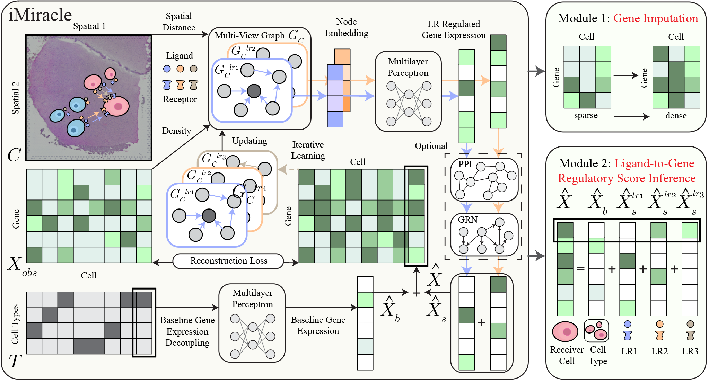

# iMiracle: an Iterative Multi-View Graph Neural Network to Model Intercellular Gene Regulation From Spatial Transcriptomic Data

## Introduction

iMiracle is an iterative multi-view graph neural network designed for modeling intercellular gene regulation from spatial transcriptomic data.
First, It integrates inter- and intra-cellular networks for accurate expression imputation using ligand-receptor (LR) interactions with neighboring cells. Optionally, it allows users to include prior knowledge of intra-cellular networks, such as protein-protein interaction network (PPI) and gene regulatory network (GRN), as pre-structured masks to further maintain biological relevance.
Second, iMiracle employs iterative learning to gradually fill in the missing edges in the cell-cell communication (CCC) network, circumventing the limitations posed by the sparsity of spatial transcriptomic data.
Lastly, iMiracle infers a cell-specific ligand-gene regulatory score based on the contributions of different LR pairs to help us interpret inter-cellular regulation.

## Installation Guide

Before using iMiracle, ensure the following dependencies are installed:

- `torch==1.12.1`: For building and training neural network models.
- `torch_geometric==2.2.0`: For the backbone GNN architecture.
- `pandas==1.4.2`: For data manipulation and analysis.
- `numpy==1.22.4`: For numerical computing.
- `scipy==1.10.1`: Provides tools and algorithms for scientific computing.
- `scanpy==1.9.3`: For single-cell RNA sequencing data analysis.
- `anndata==0.8.0`: For handling large-scale single-cell RNA sequencing data.
- `sklearn==1.2.1`: For model evaluation and additional machine learning tools.

These dependencies can be installed using pip:
```
pip install torch==1.12.1 torch_geometric==2.2.0 pandas==1.4.2 numpy==1.22.4 scipy==1.10.1 scanpy==1.9.3 anndata==0.8.0 sklearn==1.2.1
```

## Usage Instructions

To perform imputation using iMiracle, refer to the content in `example_imputation.py`. This script demonstrates how to set up the data, configure, and run the iMiracle model for spatial transcriptomic data analysis.

## Code Structure and File Description

- `data.py`: Functions for loading and preprocessing data.
- `multiview_graph.py`: Implementation of the multi-view graph.
- `neural_networks.py`: Neural network architecture of iMiracle.
- `train_utils.py`: Training utilities for the iMiracle model.
- `example_imputation.py`: Example script for data imputation using iMiracle.

## Contact
 <!-- and Citation -->

<!-- Please cite our paper if you use iMiracle in your research:

[Insert citation details here] -->

For questions or support, contact zihend1@uci.edu.
